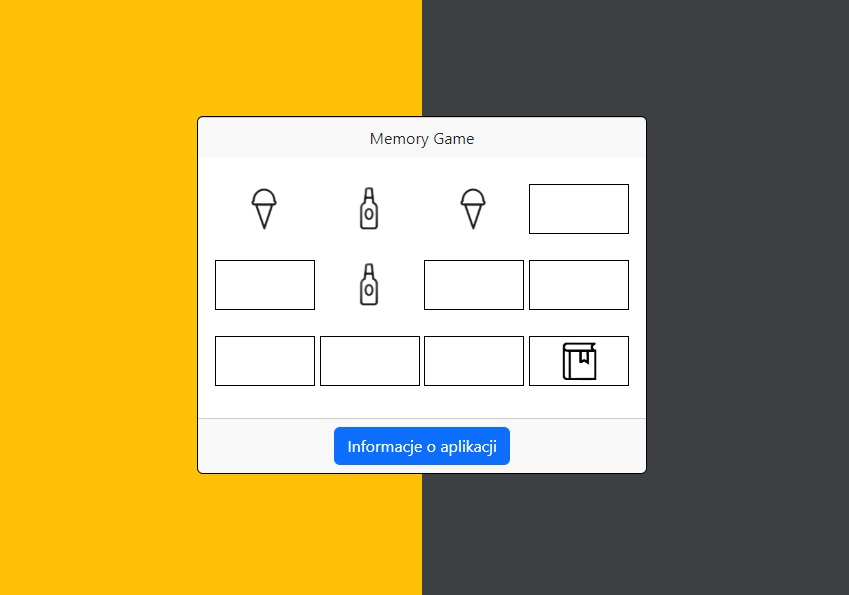

# :desktop_computer: MemoryGame

The application displays a board of 12 cards, and the user can reveal two cards at a time. If the user reveals two cards with the same pattern, the application counts it as a success and blocks the possibility of selecting them again. The game ends when the user guesses all 12 cards.

## :framed_picture: Screenshots

## :joystick: Demo

https://kamilkeder.github.io/MemoryGame/

## :e-mail: Feedback

If you have any feedback, please reach out to me at kontaktkkeder@gmail.com
